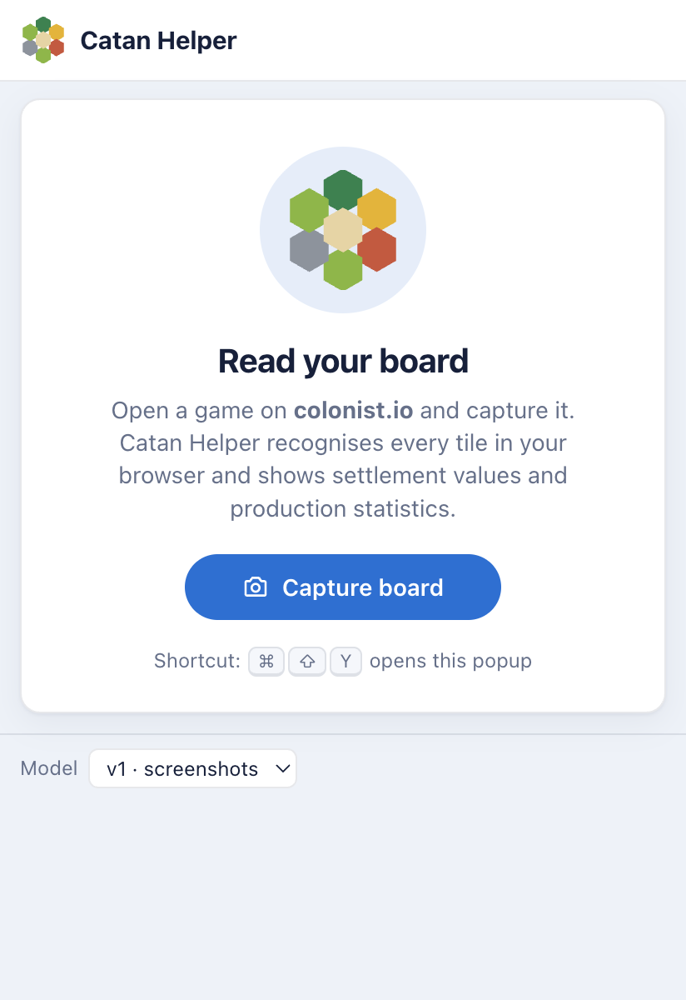
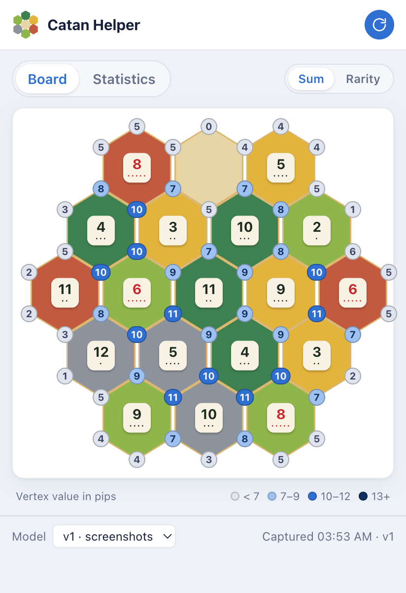
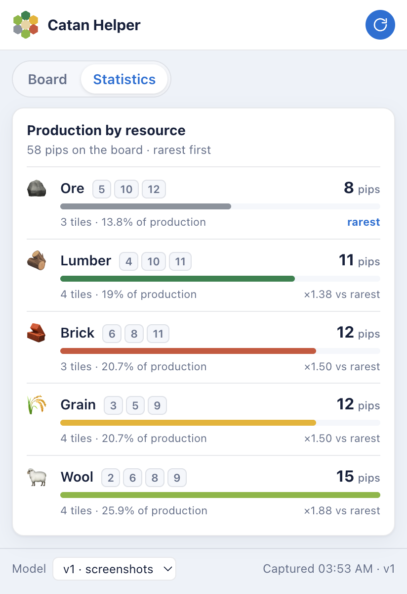

# Catan Helper (on-device edition)

Chrome extension that reads a [colonist.io](https://colonist.io) Catan board from a screenshot and shows
production statistics and settlement values. Recognition runs entirely inside the popup with
[TensorFlow.js](https://www.tensorflow.org/js): nothing leaves the browser and no server is needed.

This folder supersedes `../extension` + `../back`/`../back-new`, which kept the recognition on a backend.

| Capture                            | Board                          | Statistics                               |
| ---------------------------------- | ------------------------------ | ---------------------------------------- |
|  |  |  |

The popup follows the system colour scheme; see `docs/popup-board-dark.png` for the dark variant.

## Using it

```bash
npm install
npm run build          # writes the loadable extension to dist/
```

Then open `chrome://extensions`, enable _Developer mode_, choose _Load unpacked_ and select `dist/`.
Open a game on colonist.io, click the extension icon and press **Capture board**.

The board layout is measured on a 3024x1516 capture (a 1512x758 window at 2x pixel density), the same
assumption the original backend made. Other window sizes are rejected with an explanatory message; see
`src/vision/layout.ts` to add another layout.

## Development

| Command               | What it does                                                                                                                                                                       |
| --------------------- | ---------------------------------------------------------------------------------------------------------------------------------------------------------------------------------- |
| `npm run dev`         | Vite dev server. Without Chrome APIs the "capture" loads the sample screenshot from `test/fixtures`, so the whole pipeline (models included) runs in a normal tab with hot reload. |
| `npm run build:watch` | Rebuilds `dist/` on every change; reload the unpacked extension to pick them up.                                                                                                   |
| `npm test`            | Unit tests plus an end-to-end test that runs both models on the sample screenshot in Node.                                                                                         |
| `npm run typecheck`   | `tsc -b` with strict settings.                                                                                                                                                     |
| `npm run lint`        | ESLint (flat config, typescript-eslint, react-hooks).                                                                                                                              |
| `npm run format`      | Prettier.                                                                                                                                                                          |

Node 22 or newer (`.nvmrc`). Unlike the old backend there is no native TensorFlow binding, so any current
Node works.

## Architecture

Dependencies point downwards only: `components` and `app` use `domain`, `vision` and `platform`;
`vision` uses `domain`; `domain` uses nothing.

```
src/
├── main.tsx            Composition root: wires real Chrome capture or the dev fixture into the analyzer.
├── App.tsx             Popup layout: tabs, notices, board / statistics views.
├── app/                Use case and React state.
│   ├── boardAnalyzer.ts   capture screenshot → read board; lazy, shared model loading.
│   ├── useBoardAnalysis.ts hook: restores last reading, runs new analyses, maps errors.
│   └── describeError.ts   error → user-facing sentence.
├── domain/             Pure Catan rules, fully unit-tested, no browser or ML imports.
│   ├── board.ts           Resource / HexNumber / Tile / Board types, validation, plausibility warnings.
│   ├── probability.ts     pips and roll probabilities.
│   ├── statistics.ts      per-resource production, scarcity factors.
│   └── vertices.ts        tile ↔ vertex tables and vertex values.
├── vision/             Screenshot → Board.
│   ├── modelSets.ts       Registry of shipped model sets (id, label, paths) and the default.
│   ├── pixels.ts          RgbaImage, cropping, RGBA→RGB. Environment independent.
│   ├── boardLocator.ts    Finds the number tokens and fits the hex lattice: board centre + tile spacing.
│   ├── layout.ts          Tile centres and crop rectangles derived from that geometry; reference offsets.
│   ├── labels.ts          Model class order (fixed by training, see ../train-model).
│   ├── classifier.ts      TileClassifier: one Keras model, batched inference, argmax + confidence.
│   ├── boardReader.ts     Crops all tiles, runs both classifiers, builds a validated Board.
│   └── tfjs.ts            Backend selection (WebGL, then CPU).
├── platform/           Thin adapters over browser / Chrome APIs.
│   ├── screenshot.ts      chrome.tabs.captureVisibleTab with the colonist.io check.
│   ├── decodeImage.ts     data URL / URL → RgbaImage via ImageBitmap + OffscreenCanvas.
│   ├── analysisStore.ts   last reading in chrome.storage.session (memory fallback in dev).
│   ├── settingsStore.ts   user preferences (chosen model set) in chrome.storage.local.
│   └── runtime.ts         extension vs dev-server detection, asset URLs.
├── components/         Presentational React components, one folder each with its CSS.
│   ├── Header, StatusBar  Frame of the popup: brand + capture button, model picker + capture time.
│   ├── Segmented          Radio group styled as a segmented control (Board/Statistics, Sum/Rarity).
│   ├── Board, Hexagon     Absolutely positioned hex grid; the board draws each of the 54 vertices once.
│   ├── Legend             Vertex value bands.
│   ├── Statistics         Resources ranked rarest first with pips, numbers and share bars.
│   ├── Welcome, Notice    Empty/loading state and error or warning banners.
│   └── ModelPicker, Icons
└── mocks/              Dev-server stand-ins (fixture screenshot).
public/
├── manifest.json       MV3 manifest. Permissions: activeTab (capture + URL of the current tab), storage.
│                       Also declares the Cmd/Ctrl+Shift+Y shortcut that opens the popup.
├── models/             One folder per model set, each with resources/, numbers/ and a manifest.json.
│   ├── v1/                The 2025 models trained on screenshots (from ../back-new/models).
│   └── v2-synthetic/      Trained in ../training on synthetic boards built from the game artwork.
└── icons/
test/
├── boardLocator.spec.ts     Locates the board in every fixture screenshot.
├── boardReader.e2e.spec.ts  Reads every fixture with every model set, tile by tile.
├── nodeModelSource.ts       IOHandler that reads model.json + weights.bin without tfjs-node.
├── loadPng.ts               PNG → RgbaImage for tests and scripts.
└── fixtures/                Real captures at 1280x720, 1366x768, 1920x1080 (1x) and 1512x758 (2x), with
                             hand-read ground truth in index.ts.
scripts/
└── evaluate-models.ts       `npm run evaluate`: per-fixture, per-set accuracy table.
```

### How a capture flows

1. `captureActiveTab` checks the tab is on colonist.io and asks Chrome for a PNG data URL.
2. `decodeDataUrl` turns it into raw RGBA pixels.
3. `boardReader.read` locates the board (`boardLocator`), crops 19 resource tiles and 19 number tokens
   scaled to model size, classifies each set in one batched inference and validates the labels into a
   `Board`.
4. The hook stores the reading in session storage and the components derive statistics from it.

### Checking against a live game

`chrome.tabs.captureVisibleTab` only works with `activeTab` (granted by clicking the icon or using the
shortcut) or `<all_urls>`. An automated harness therefore cannot open the popup with capture rights unless
it installs a copy of `dist/` whose manifest adds `"host_permissions": ["<all_urls>"]`; that is a
test-only change, never ship it. With such a copy loaded, `chrome.action.openPopup()` from any extension
page opens the real popup and the capture flow can be driven end to end.

### Model sets

Several model sets ship side by side so they can be compared on real games. The popup has a picker in its
footer, the choice is remembered, and each reading records which set produced it. `src/vision/modelSets.ts`
lists the sets and the default.

To add a set: train it in `../training` (or copy `model.json` + `weights.bin` pairs into
`public/models/<id>/{resources,numbers}/` with a `manifest.json`), register it in `modelSets.ts`, and run
`npm test` and `npm run evaluate`. The class order in `src/vision/labels.ts` must match the training order;
the end-to-end test fails on a class-count mismatch.
